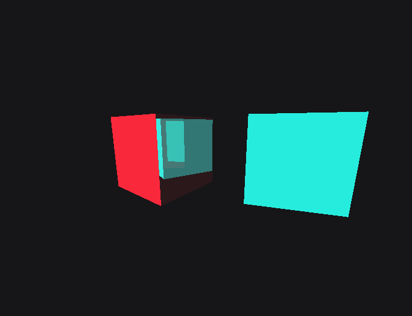

🌈 **Vulkan raytracing with [liblava](https://git.io/liblava)**

## Features

Support for the Vulkan KHR ray tracing extensions, integrated into liblava with idiomatic wrappers in `lava::extras::raytracing`.

### Acceleration structures

- abstraction over `VK_KHR_acceleration_structure`
- `bottom_level_acceleration_structure` (BLAS) and `top_level_acceleration_structure` (TLAS) objects to
    - create
    - build
    - update
    - compact

### Raytracing pipeline

- abstraction over `VK_KHR_ray_tracing_pipeline`
- `raytracing_pipeline` object with support for shader groups

### Shader binding table

- `shader_binding_table` object to automatically

    - generate SBT layout with correct alignments
    - fill SBT with shader group handles
    - and shader record data (parameters)

    from a `raytracing_pipeline`

## Demo

##### [raytracing cubes](demo/cubes.cpp) • raytraced reflecting cubes

<a href="demo/cubes.cpp"></a>

This demo showcases:

- BLAS and TLAS creation
- BLAS compaction
- TLAS update each frame with transformation matrices
- callable shader
- SBT shader records

Build it with:

```sh
mkdir build & cd build
cmake ..
cmake --build . --parallel
```

To recompile shaders, run the appropriate `gen_spirv` script in `demo/res/cubes`.

## TODO

*Non-exhaustive list:*

- host command support for acceleration structures
- serialization support
- test intersection shaders
- move SBT to device-local memory
